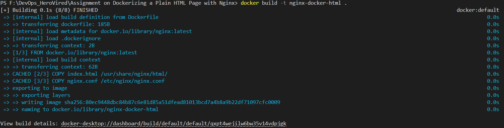
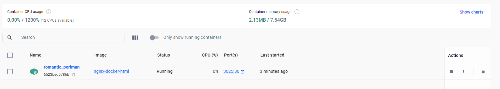
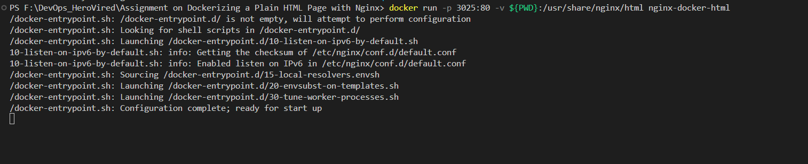
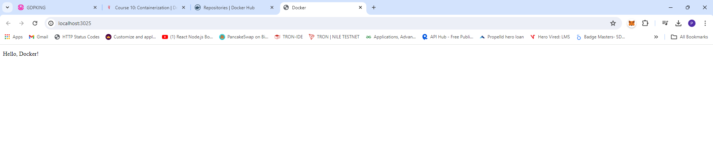
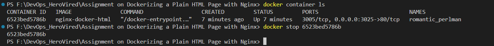
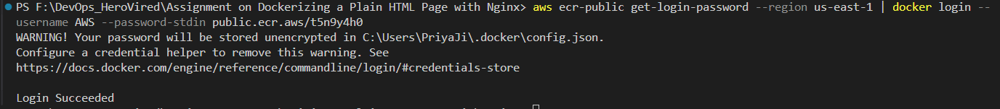
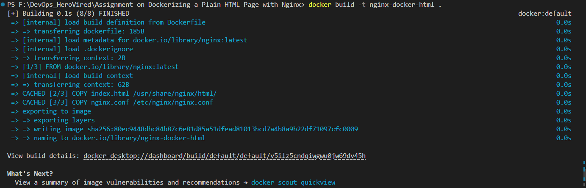
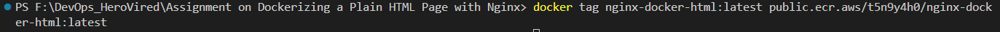
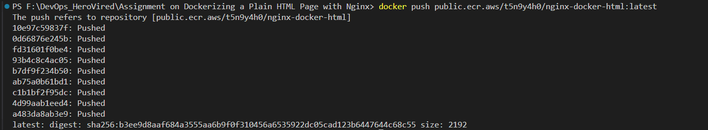
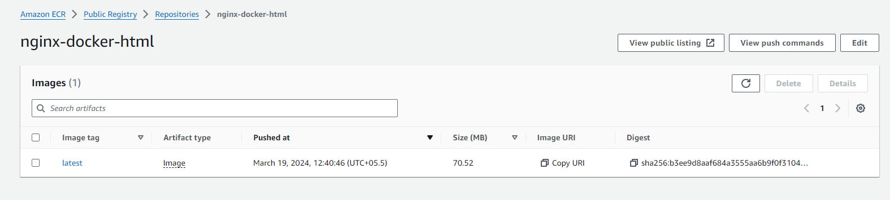

# Dockerizing a Simple HTML Page with Nginx

This repository demonstrates how to Dockerize a simple HTML page using Nginx as the web server.

## Github URL
```https://github.com/surendergupta/Dockerizing-a-Plain-HTML-Page-with-Nginx.git```

## Files

### index.html

- **Purpose:** This file contains a basic HTML page with some content.
- **Usage:** It serves as the main content of the web page when accessed through the Nginx server.

### nginx.conf

- **Purpose:** This file is the Nginx configuration file that specifies how the Nginx server should behave.
- **Usage:** It configures Nginx to listen on port 80 and serve the `index.html` page.

### Dockerfile

- **Purpose:** This file is used to define the Docker image.
- **Usage:** It builds a Docker image based on the official Nginx image, copies the `index.html` and `nginx.conf` files into the appropriate locations in the container, and starts the Nginx server when the container is run.

## Building and Running the Docker Container

1. **Build the Docker Image:**
    ```docker build -t nginx-docker-html .```
    

2. **Run the Docker Container:**
    ```docker run -p 3025:80 -v ${PWD}:/usr/share/nginx/html nginx-docker-html```
    
    

    

3. **Access the Web Page:**
    Open a web browser and navigate to `http://localhost:3025/` to view the served HTML page.
    
    

4. **Stop the Docker Container (Optional):**
    ```docker stop <container-id>```
    
    
    
    Replace `<container-id>` with the ID of the running container.
5. **Log in to Amazon ECR**
    Before pushing the image, you need to authenticate Docker to your ECR registry: 
    Use the AWS CLI:
    ```aws ecr get-login-password --region <your-region> | docker login --username AWS --password-stdin <your-ecr-registry-uri>```

    ```aws ecr-public get-login-password --region us-east-1 | docker login --username AWS --password-stdin public.ecr.aws/t5n9y4h0```

    Replace <your-region> with the AWS region where your ECR repository is located, and <your-ecr-registry-uri> with your ECR registry URI.

    

6. **Build your Docker image using the following command. You can skip this step if your image is already built:**
    ```docker build -t nginx-docker-html .```

    

7. **After the build completes, tag your image so you can push the image to this repository: Tag your Docker image:**

    ```docker tag nginx-docker-html:latest public.ecr.aws/t5n9y4h0/nginx-docker-html:latest```

   

8. **Push your Docker image to ECR**
    ```docker push public.ecr.aws/t5n9y4h0/nginx-docker-html:latest```
    After running this command, your Docker image will be pushed to your ECR repository.

    

    

9. **Public Repository on ECR**
    ```public.ecr.aws/t5n9y4h0/nginx-docker-html:latest```


